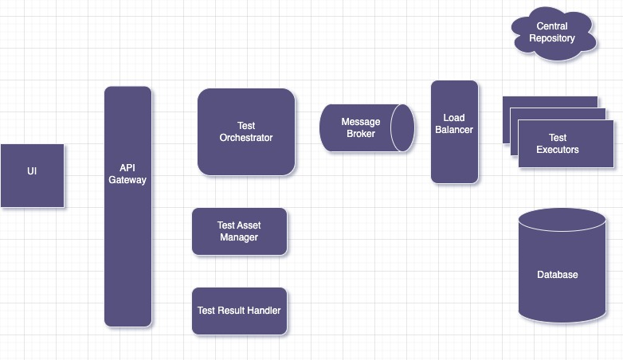

# Ciara

Ciara is a Test Orchestration Application that manages the scheduling and execution of tests.

## Architecture
Below is high level architecture of the system and for this project I have implemented Test Orchestrator along with dummy test executor.




## Getting Started

These instructions will guide you through building and running the Ciara application using Docker Compose.

### Prerequisites

Before you begin, make sure you have the following prerequisites installed on your system:

- [Docker](https://www.docker.com/get-started)
- [Docker Compose](https://docs.docker.com/compose/install/)

### Clone the Repository

Clone the Ciara repository to your local machine:

```bash
git clone https://github.com/harkeganesh/ciara.git
cd ciara
```

### Build and Start the Services
Use Docker Compose to build and start the Ciara services:
```bash
docker-compose up -d --build
```

This command will build the Docker images and start the application services. You should see logs indicating the services are running.

### Access the Application
Once the services are up and running, you can access the Ciara application in your web browser by navigating to:

```arduino
http://localhost:8004/

```

### Scale the application

Try adding more worker wit below command

```bash
docker-compose up -d --build --scale worker=5
```

### Shutdown the Application
To stop and remove the Ciara services, use the following command:
```bash
docker-compose down
```
